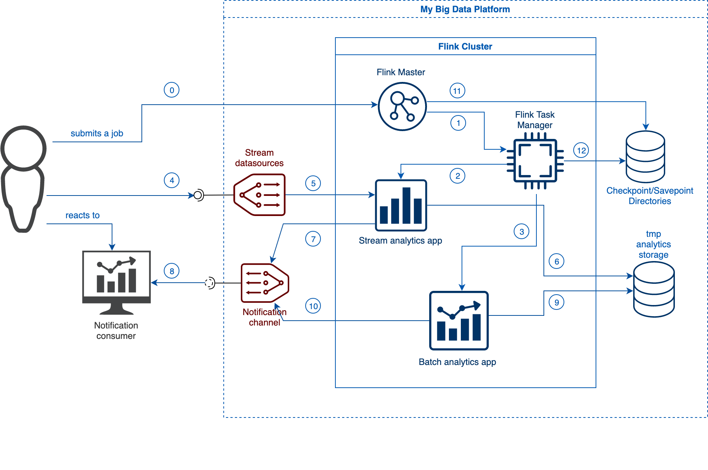
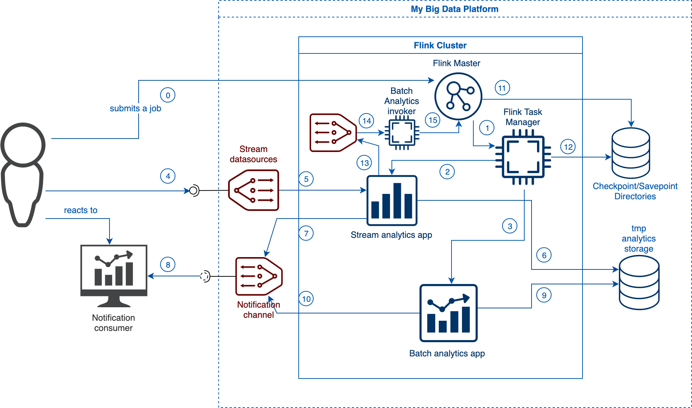

# Assignment 3
## Part 1 - Design for stream analytics
### 1.1 - Dataset and stream analytics
For this assignment I have chosen a different dataset comparing to previous assignments, and it is the BTS dataset. It has been chosen because of the amount of data analytics that can be performed and because of the time series event types of the dataset records.

The dataset records have the following structure:

- `station_id` - the id of the station that has produced the event;
- `datapoint_id` - the id of the sensor (datapoint);
- `alarm_id` - the id of the alarm;
- `event_time` - the time at which the event occurs;
- `value` - the value of the measurement of the datapoint;
- `valueThreshold` - the threshold set for the alarm. Note that some threshold values are set to a default value of 999999;
- `isActive` - the alarm is active (true ) or not (false);

Because the events represents the sensor value when a given threshold is reached, the amount of analytical outcomes is limited to the reaction based on the frequency with which the given thresholds were breached.

For example for **streaming analytics** it can be the following:

- for how many times, within a time interval of 1 hour, the power grid sensor detected a low (or high) AC voltage?
- what was the average value of the voltage above (or below) the threshold during that window?
- how frequently does an equipment report `failed equipment` status?

Consequently, for **batch analytics** we may question:

- during which part of the day (morning, noon, evening, night) were registered the most frequent power grid AC voltage threshold breaches?
- what equipments reported `failed equipment` status within a day and which of them reported it more that 3 times?
- how does high (low) power grid voltage relates to equipment failures?

To be noted that stream analytics operates in near real time withind a window bound (for example one hour) and batch analytics processes the results of the stream analytics, but having a greater window (for example one day).

### 1.2 - Keys and delivery guarantees
Because BTS dataset records are homogeneous by structure, but with different content significance, in order to perform meaningful analytics, the data must be keyed. For example there should be differentiated the humidity records - with id 115, from total battery voltage records - with id 141. Moreover, we need to differentiate the alarm types: failed equipment, high DC voltage, low AC voltage, etc. Thus, one use case scenario would be to key our data by three fields: 

- `alarm_id` - we need to easily spot what failure took place;
- `station_id` - we have to identify what station causes failures or needs to be investigated manually; 
- `datapoint_id` - we have to identify the sensor that caused the failure (it is especially important when the equipment fails).

By analyzing the BTS dataset, I have noticed that some alert ids appear more frequent than others. For example the power grid voltage sensor (with id 121) produces more alerts that the rest of the sensors. Thus, there may be such a use case when in order to speed up the stream processing and analytics time for other events, that are delayed because of the presence of the former enumerated events, it is suitable to perform an early separation of events based on sensor type. So the `datapoint_id` becomes the routing key for the data broker exchange which causes the messages to be split across different queues. As a result, there would be present several producer queues in the data broker:

Example of queues depending on some heuristic function that takes into account the distribution of messages given the `datapoint_id`:

- `power.grid.voltage.queue` - with datapoint id `121`;
- `humidity.queue` - with datapoint id `115`;
- `total.battery.voltage.queue` - with datapoint id `141`;
- `other.alert.messages.queue` - with other datapoint ids which are less frequent and that can be combined in the same queue.

Regarding the delivery quarantees, BTS data is not so critical to have imposed strict guarantee rules. Having this, **at least once delivery** has to be sufficient, because repetitions of message processing does not impact so much the conclusions that have to be made. Of course this has to be adjusted to the error rate desired by the customer. 

In case the customer desires a more strict delivery guarantee, `Apache Flink` guarantees **exactly once delivery** within its ecosystem, and being combined with `Apache Kafka` or `RabbitMq` - this guarantee is fulfilled. For this demonstration of the concept, I will use `Apache Flink` and `RabbitMq` with **exactly once delivery**.

### 1.3 - Time associations and windows
#### Time

Having the BTS dataset, where the records are prepopulated with a timestamp, for the analytics there will be chosen the **event time** and respectively - `TumblingEventTimeWindows`. This must be done because the major importance for analysis is to determine when the event occured, rather than when the event was processed. For example there is needed to be calculated the number of times an equipment failed within a specific time interval (which is specified by the window length), or how many times and what was the average voltage value when a low AC voltage alarm was triggered within a specific interval of time. For this reason, the event time is critical and other event times will generate a less accurate result. 

Of course, it has to be taken into account that it is very difficult, if not impossible, to synchronize the clock of all the sensor devices, and that the event time has a marginal error, but it is usually neglectable comparing to the length of the time interval upon which the observation is made.

If, for some reason, the dataset records will not have a timestamp associated with them, then the **ingestion time** must be considered. Ingestion time gives more predictable results comparing to **processing time**. Because *ingestion time* uses stable timestamps (assigned once at the source), different window operations over the records will refer to the same timestamp, whereas in *processing time* each window operator may assign the record to a different window (based on the local system clock and any transport delay).

Unfortunately, when the event does not have a timestamp assigned to them, the program cannot handle any out-of-order events or late data.

Ingestion time can be set in Flink by: 

```java
final StreamExecutionEnvironment env = StreamExecutionEnvironment.getExecutionEnvironment();
env.setStreamTimeCharacteristic(TimeCharacteristic.IngestionTime);
```

The rest of the program is similar to the one using the event time.

#### Windowing

As it was explained above, the chosen window type is the keyed `TumblingEventTimeWindows`. It is necessary to use keyed windows in order to group the records by three characteristics: `alarm_id`, `station_id`, `datapoint_id`. These keys will be present in the final aggregation message that is delivered back to the client altogether with the aggregation result.

Tumbling windows where chosen because it was preffered to have a fixed time interval where each event is assigned only one window and is processed only once. This makes the aggregation logic and result interpretation easier.

In case the customer would have desired to have a notification when a sensor reports `equipment failed` within an interval of time regardless when it begins, then it must be used the `SlidingEventTimeWindows`. In this case the events are shared and processed within multiple windows. Ex: If during 1 hour a sensor is emitting 5 times that the equipment failed, an alert is raised and sent to client. 

### 1.4 Metrics

One of the most important metric that must be considered is the number of processed messages per second. Events are coming from multiple devices and that have to be processed as soon as possible in case an emergency is taking place.

Another metric that would be suitable for our customer given the BTS dataset is the number of late records dropped. This is especially important because the events are highly unordered given the event timestamp. If a big percentage of events are dropped because they are late, this means that the allowed late messages timeout must be increased. Example: all power outrage events from sensor with id `123` are being dropped because they are late - this means that we are not able to take the necessary actions to replace the power supplier block.

Both of these metrics, along with other useful metrics can be monitored on Flink administration page.

### 1.5 Architecture. Components Design Diagram



The architecture of the streaming analytics service can be see in the diagram above. Customer data sources are event messages producers that enque messages into `Stream datasources` provided by **My BDP**. 

The messages are inserted in a JSON format and consumed by **Stream Analytics App**.

`Stream datasources` are the message broker of the BDP represented by RabbitMq instances. I have chosen RabbitMq because it supports multiple messaging protocols, message queuing, delivery acknowledgement, flexible routing to queues, multiple exchange type. Moreover, RabbitMq can be deployed as clusters for high availability and throughtput. Also, RabbitMq + Flink transaction model can guarantee exactly once delivery.

For each customer there exists a direct `exchange` resource defined inside the broker that is binded to several queues depending on the routing key. This is done to route the messages that are less frequent, but which have a greater importance, to separate queues so that they could be processed faster by a separate job.

For example the messages regarding power grid voltage will be rounted to `power.grid.voltage.queue` by using the binding with routing key `121`.

Streaming computing service is represented by a suite of services grouped within **Flink cluster**. The main computing engine that is responsible for executing the analytics jobs (**Stream Analytics App**s or **Batch Analytics App**s) is `Flink Task Manager`. It receives a job from `Flink Master`, executes it, and manages its execution. `Flink Master` is reponsible for receiving jobs that are submited by the customer. 

Customer streaming analytics app is represented by a customer Flink job submitted to Flink Master. For each of the defined queues in the message broker, there will be a separate job that will process its messages. Optionally, the streaming analytics app may save the output (or the dequed messaged) to a `Temporary Analytics Storage` that will be later used by another customer job - `Customer Batch Analytics App`. The result of the stream analytics are sent in near real-time to `Customer Notification Channels` that may be various: being those message brokers, email/SMS/slack notifications to customer. The customer then reacts to analytics result messages by using the `Notification Consumer`. 

The results of `Customer Batch Analytics App` may be sent to customer notification channel as a PDF or XLS report. The resulting reports are having a broader overview of the occured events on a bigger time interval.

The full scenario can be seen on the design diagram above ordered with a sequence number inside a circle.

0. User submits a job to `Streaming Computing Service` (`Flink Cluster`). It is received by `Flink Master`;
1. `Flink Master` invokes the job execution within `Flink Task Manager`;
2. `Flink Task Manager` executes and monitors the streaming analytics jobs' executions;
3. `Flink Task Manager` executes and monitors the batch analytics jobs' executions;
4. Customer produces event messages and delivers them to `Stream Datasources`;
5. `Stream Analytics App` consumes and processes the event messages from `Stream Datasources`;
6. Optionally, stream analytics app persists the processing results;
7. `Stream Analytics App` delivers analytics processing results to `Customer Notification Channel`s in near real-time;
8. `Customer Notification Consumer` receives the analytics results and waits for customer's reaction (or reacts according to a programmed algorithm);
9. Being triggered by a squeduled job that instantiated on the fly the `Batch Analytics App` within a defined job period, the batch analytics app reads the saved analytics results from `Temporary Analytics Storage`;
10. Batch analytics processing results are being delivered to `Customer Notification Channel`s;
11. `Flink Master`, in order to ensure high availability and resilience, defines checkpoints and savepoints in order to be able to recover when a failure occurs and the instance will be stopped. For this there will be used persistent `Checkpoint/Savepoint Directories`;
12. The above step is performed by `Flink Task Manager`.

## Part 2 - Implementation of streaming analytics
### 2.1 - The structure of the input and output stream data
The input streaming data is defined by the following Java class:

```java
@Data
@AllArgsConstructor
@NoArgsConstructor
public class AlarmRecord {

    private long stationId;

    private int dataPointId;

    private int alarmId;

    @JsonFormat(shape = JsonFormat.Shape.STRING, pattern = "yyyy-MM-dd HH:mm:ss z")
    private Date eventTime;

    private double value;

    private double valueThreshold;

    private boolean isActive;
}
```

The `eventTime` is used to divide messages across windows. The key will be defined by `stationId`, `dataPointId`, and `alarmId`.

The chosen message format for marshalling and unmarshalling is JSON. The messages are marshalled to JSON format, and then serialized and delivered to stream datasources. Stream analytics app is consuming these events using the same unmarshalling format.

The analytics result event has the following format:

```java
@Data
@AllArgsConstructor
@NoArgsConstructor
public class LowPowerGridVoltageAlarm {

    @JsonFormat(shape = JsonFormat.Shape.STRING, pattern = "yyyy-MM-dd HH:mm:ss z")
    private Date windowStart;

    @JsonFormat(shape = JsonFormat.Shape.STRING, pattern = "yyyy-MM-dd HH:mm:ss z")
    private Date windowEnd;

    private int datapointId;

    private long stationId;

    private int alarmId;

    private long numberOfPowerGridVoltageOutrage;
}
```

where the last field's name - `numberOfPowerGridVoltageOutrage`, differs from the analytics type performed. The resulting event specifies when the analytics window begins and ends, for what key the analytics was performed, and what is the resulting value (in this case the number of times the it was reported low power grid voltage).

### 2.2 - Event Processing Functions

First function that is a key component of analytics processing represents the assigning timestamps and watermarks to the ingress events. Because our events come out of order we cannot emit new watermarks based on the current processed event. Instead of this, one of the strategies would be to emit watermarks as the oldest timestamp among the last **N** processed events (for example last 5 events).

For this, I have created a custom class that implements the above mentioned approach:

```java
public class LastNEventsWatermark implements AssignerWithPeriodicWatermarks<AlarmRecord> {

    private static final int NUMBER_OF_LAST_EVENTS = 3;
    private final TreeSet<Long> lastXTimestamps = new TreeSet<>();

    @Nullable
    @Override
    public Watermark getCurrentWatermark() {
        if (!lastXTimestamps.isEmpty() && lastXTimestamps.size() < NUMBER_OF_LAST_EVENTS) {
            return new Watermark(lastXTimestamps.first());
        }

        return Optional.ofNullable(lastXTimestamps.pollFirst()).map(Watermark::new).orElse(null);
    }

    @Override
    public long extractTimestamp(AlarmRecord element, long previousElementTimestamp) {
        long timestamp = element.getEventTime().getTime();
        lastXTimestamps.add(timestamp);
        return timestamp;
    }
}
```

Next important component of the pipeline is the key selector. It is defined as follows:

```java
.keyBy(new KeySelector<AlarmRecord, Tuple3<Integer, Long, Integer>>() {
    @Override
    public Tuple3<Integer, Long, Integer> getKey(AlarmRecord value) throws Exception {
        return new Tuple3<>(value.getDataPointId(), value.getStationId(), value.getAlarmId());
    }
})
```

The newly defined key groups the events by the key mentioned in section **1.2**.

The window is a `TumblingEventTimeWindows` of a given size. For example 10 minutes. Moreover, we allow late elements to be processed with an interval of 15 minutes.

Because we want to count the number of events, we have to define a counting aggregator:

```java
public class CountingAggregator implements AggregateFunction<AlarmRecord, Long, Long> {

    @Override
    public Long createAccumulator() {
        return 0L;
    }

    @Override
    public Long add(AlarmRecord alarmRecord, Long accumulator) {
        return accumulator + 1L;
    }

    @Override
    public Long getResult(Long accumulator) {
        return accumulator;
    }

    @Override
    public Long merge(Long a, Long b) {
        return a + b;
    }
}
```

and a collector to collect the output of the above aggregator:

```java
public class LowPowerGridVoltageAlarmCollector
        extends ProcessWindowFunction<Long, LowPowerGridVoltageAlarm, Tuple3<Integer, Long, Integer>, TimeWindow> {

    @Override
    public void process(Tuple3<Integer, Long, Integer> key,
                        Context context,
                        Iterable<Long> iterable,
                        Collector<LowPowerGridVoltageAlarm> collector) throws Exception {
        Long count = iterable.iterator().next();

        Date startTime = new Date(context.window().getStart());
        Date endTime = new Date(context.window().getEnd());

        collector.collect(new LowPowerGridVoltageAlarm(startTime, endTime, key.f0, key.f1, key.f2, count));
    }
}
```

The last collector simply creates a new instance of the statistics event and populates it with count value computed in the previous counting aggregator, along with the fields that were used as key and window's time interval.

### 2.3 Testing and results

The first test run on BTS dataset was with the following parameters:
- window size = 10 minutes
- allowed lateness time interval = 15 minutes
- number of events for computing the watermark = 3
- number of aggregator workers (parallel jobs for aggregation step) = 5

The test is deploying the `EquipmentFailedCount` job.

Because at the beginning data is highly unordered and atermarks are generated based on first three events, given the high ingress rate of events (on my local machine rate is 2566 messages per second given flink metrics) we can see several late events being dropped (1067 events). The log output can be seen in file **test_1.log**. Total processing time consists 10 min 21 seconds. Number of logged output messages - 563. 

Unfortunately, during the test run, some of the resulting events were lost. We can notice no events being consumed by the test listener within the window time `"2017-02-19 04:40:00 UTC"` and `"2017-02-26 14:40:00 UTC"`. 

After changing the parameter to:
- window size = 10 minutes
- allowed lateness time interval = 15 minutes
- number of events for computing the watermark = 10
- number of aggregator workers (parallel jobs for aggregation step) = 8

The logs for the second test run can be seen in file **test_2.log**. Ingress rate is the same. Number of late events - 1067. Number of logged output messages - 2524. 

During the second test, flink didn't experience any failures, comparing to the first test, but we still see the late events being dropped. Increasing the number of events for computing the watermark didn't help diminishing that number. Which means that in order to have a higher consistency, it is needed to increase the allowed latness time interval.

Regarding performance, we can see that on local machin e performance didn't improve by increasing the number of workers. But this should not be the case for a cloud environmnet, were resources are spawned and concurrency transforms into parallel execution on multiple instances.

Another performance improvement might be considering sliding windows instead of fixed time windows and sending alerts only when the number of failed equipment events per 10 minutes exceeds a certain limit (for example 5).

A third test has been performed (with the same configuration as for the second test), and for this time the test output message consumer was disabled, and thus no output message was logged. And it turns out that after running it multiple times, we have a consistent number of analytics output messages generated - 6049. The consumer was enabled afterwards and the messages were output in **test_3.log** file.

### 2.4 Testing with erroneous data
In my tests I am executing the pipeline listening to `equipment.failed.queue` and counting the number of times each sensor has reported `Equipment failed alarm (alarm_id = 303)`.

The test that produces data and listens for analytics events can be found in `./code/testingframework/`. There are two tests defined in a BDD style. If you want to run just one test, annotate the given scenario with `@RunOnlyThis`. Scenarios can be found in `RabbitMQ.feature` file.

There are currently two tests that can be configured to generate desired test data. One test simply parses a csv file, marshalls the record according to JSON format, and sends the JSON string to RabbitMq `alarms` exchange. The second tests does the same as the previous one, but it also erronously modifies the inserted data (for example sets event timestamp to `null`).

The tests simulates just customer behavior, which means we only produce event records and listen to analytics event output queue.

Because our stream analytics app implementation is not fault tolerant (to be mentioned that if the message is malformatted, then the pipeline will stop being executed and will continuously restart and throw exceptions) when a given timestamp is not assigned to the ingress event. Even though in my implementation I have considered the previous event's timestamp for computing the watermark for the current event if the current event timestamp is `null`, the application still crashes (please see `test_4_flink_error.log`).

The application will crash also when it will receive a malformed JSON message.

The second test has an error rate parameter configuration (1 out of `X` events is erroneous). In order to run with a different error rate, change the `X` rate.

Having a local machine, I am not able to test different scenarios as decreasing performance adaptation.

From other point of view, flink Job Manager and Task Manager configure checkpoint and savepoint directories. This allows flink to securely restore a failed job. Because these directories are persistent, even in case of a machine failure, the jobs would be restored after the machine is restarted.

### 2.5 Parallelism
As can be seen in architecture diagram in section **1.5**, flink cluster consists of several components, among which is `TaskManager`. This component is responsible for managing execution environmnet inside which runs customer stream analytics app. 

Each part of flink application pipeline defined inside customer stream analytics app is executed by one or more tasks, and for each of those parts it can be configured how many tasks should run it (despite `RMQSource` - it can be executed just by one task). In order to define how many tasks can be executed after each processing function it must be invoked the `.setParallelism(numberOfTasks)` method.

In order to define a default number of tasks, there can be given an argument when invoking the stream analytics app: `-p numberOfTasks`. This will assign to each processing function defined in the pipeline that doesn't have an explicit setting of parallelism. As an example, in the second and third test from section **2.3**, the last operation (`RMQSink`) doesn't have an explicit parallelism set to it. But because the stream analytics app job is invoked with `-p 3`, `TaskManager` assignes three executors to it. 

To be noted that the total and maximum number of tasks running concurrently/parallel is defined in `flink-conf.yaml` by the property `taskmanager.numberOfTaskSlots`, which represents the maximum available task executors.

Also, in the same section **1.3** test 1 and 2 have been performed using different parallelism settings. Unfortunately, locally there wasn't gained any improvements when allocating more executors for tasks. It is expected though, that on a cloud environment to have a better performance and to benefit from this feature.

The third test was performed with the parameters:
- window size = 10 minutes
- allowed lateness time interval = 15 minutes
- number of events for computing the watermark = 5
- number of aggregator workers (parallel jobs for aggregation step) = 8

Processing time - 10 minutes 9 seconds.

The fourth test was performed with a slightly modified parameters then in the 3rd one:
- window size = 10 minutes
- allowed lateness time interval = 15 minutes
- number of events for computing the watermark = 5
- number of aggregator workers (parallel jobs for aggregation step) = 1

Processing time - 10 minutes 5 seconds.

As we can see, on local machine it is not possible to measure any performance gain by modifying the paralellism.

## 3 - Connection
### 3.1 - Storing analytics results

In case that analytics data must be persisted, along with notifying the customer, Flink supports side output feature. This allows us to split a stream in two separate streams. Moreover, during this splitting we can perform data transformation or data enhancement. In architecture design diagram, it is depicted both streaming and persisting of analytics results.

Stream splitting in flink can be achieved by implementing a process window function. For example I have prepared this function:

```java
public class SplitByAlarmIdFunction
        extends ProcessWindowFunction<EquipmentFailedAlarm, EquipmentFailedAlarm, Tuple3<Integer, Long, Integer>, TimeWindow> {

    private final OutputTag<EquipmentFailedAlarm> outputTag;

    public SplitByAlarmIdFunction(String outputTag) {
        this.outputTag = new OutputTag<>(outputTag);
    }

    @Override
    public void process(Tuple3<Integer, Long, Integer> key,
                        Context context,
                        Iterable<EquipmentFailedAlarm> elements,
                        Collector<EquipmentFailedAlarm> out) throws Exception {
        EquipmentFailedAlarm analyticsResult = elements.iterator().next();

        out.collect(analyticsResult);

        // emit data to side output
        context.output(outputTag, analyticsResult);
    }
}
```

This splitting function can be inserted after the aggregation is performed. Later on, we can get the side output stream and pipe it to a Cassandra sink;

```java
    SingleOutputStreamOperator<EquipmentFailedAlarm> statistics = alarms
        ...
        .aggregate(new CountingAggregator(), new EquipmentFailedAlarmCollector())
        .setParallelism(10)
        .name("Split alarm records");

        // this will perform splitting
        statistics.keyBy(
            // implement key selector
        )
        .timeWindow(
            // define window size
        ).process(new SplitByAlarmIdFunction("myTag"))
        .name("Spliting");

        // persistence block
        statistics.getSideOutput(new OutputTag<EquipmentFailedCount>("myTag"))
        .addSink(
            // define Cassandra (or any other persistence) sink
        );
        // end of persisting block

        statistics
        .map(
            // marshall output analytics events
        )
        .addSink(
            // define rabbitMq sink
        );
```

### 3.2 - Batch Analytics
In case of streaming analytics data persistence for a longer period of time, an example of batch analytics over the data would be to detect the windows that reported more that 5 times `equipment failed` alarm. Another batch analytics would be to determine the windows the it was reported more that 5 times `low AC voltage` for the batteries.

In order to implement such batch analytics, it may be used the same framework as for streaming analytics: Flink. Flink has also a **Batch Analytics API (DataSet API)** with which there can be performed data transformation, grouping, aggregation, reduction, filtering, and many other operations.

As a datasource, we can define a database storage and read data from it. In our case, this would be our **coredbms (tmp analytics storage)**.

### 3.3 - Batch Analytics on demand
In case a critical condition is reached and a batch analytics must be invoked, then we need to adjust our architecture as it is shown in the diagram below.



Complementary to our existing components, there will be added a separate queue for listening specifically critical alerts. This decoupling will help us fastly and resiliently react to critical alerts without being blocked or depending on other components.

Inside our Stream Analytics App implementation, is can be defined a side-output for critical alerts and sink those to a resilient queue (step 13). 

Besides this, we must have a separate component that would listen to this queue (step 14) and will be able to react to ingress critical alerts by invoking Batch Analytics App processing (step 15). To be noted that there might exist several implementations of Batch Analytics apps and our newly added component, **Batch Analytics Invoker**, is smart enough to decide what type of batch analytics must be performed according to what critical event is comming. 

Moreover, Batch Analytics Invoker must differentiate from the same event comming twice, or from events that are triggered with a high rate, and to smartly react to these type of events. It must act as an idempotent receiver based on the content of the ingress event message and to invoke only the needed amount of batch analytics instances.

### 3.4 - Scaling
Because Streaming Analytics App and Batch Analytics App are both provided by the client, the only components that need to be adjusted are the number of task executors that Flink Task Manager operates with, different instances of analytics data storage, as well as separate stream datasources and partitioned notification channels.

More task executors will allow the scaling of execution of analytics apps.

Different analytics data storages will allow to separate and partition customer analytics data and to easily recover in case of a failure. For example if one datacenter is going down, then there should be affected as few customers as possible.

Defining separate exchanges and queues for each customer (for example by prefixing them with a customer individual key), then we will solve the issue with multiple concurrent consumers for the same queue, especially the issues with acknowledging message delivery. For example when an exception occurs for one customer while consuming one message, the message doesn't get acknowledged and it stays in the queue, preventing other messages from being acknowledged, even though they are successfully processed. This problem can be avoid by supporting a smart acknowledge mode as it is `SQS.UNORDERED_ACKNOWLEDGE` mode, defined by Amazon SQS. Unfortunately it is not always possible to use such kind of features, so, in order to dimish the impact of such a use case, it is better to have multiple queues that diminish interaction between client data as much as possible.

The same technique must be applied for the notification channels.

### 3.5 - Ened-to-end exactly once delivery
First of all, let us define what are the boundaries of end-to-end. If we consider it to be the client event producing code and notification events consumption, then the answer is **no**. This is because the platform is not in control of the transactionality of those customer components and cannot interfere in their execution. Thus, we cannot guarantee end-to-end exactly once delivery.

If we consider the platform boundaries to be our end-to-end boundaries, beginning with consumption of alert events from datastream sources up to inserting analytics events into notification channel, then the answer is a little more complex.

First of all, Flink ensures excatly-once-delivery. And as long as we use the connectors supported by flink, as long as we don't explicitely drop any messages during our analytics (fact that we cannot guarantee because customer is providing stram analytics app where this code resides), then we can transfer this guarantee to flink. As a result, we can guarantee only what flink guarantees - exactly-once-delivery on the pipeline portions where the message is consumed from datastream sources, and on the portion where the analytics events are sent to notification cannel. And all this must fulfill the condition that the officially supported connectors are used.

